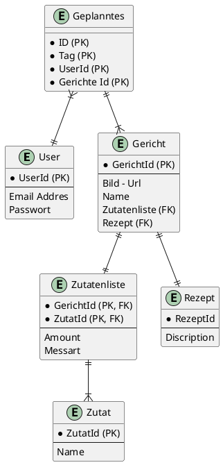

```plantuml
    @startuml
        entity User{
            * UserId (PK)
            --
            Email Addres
            Passwort
        }

        entity Gericht{
            * GerichtId (PK)
            --
            Bild - Url 
            Name
            Zutatenliste (FK)
            Rezept (FK)
        }

        entity Zutatenliste{
            * GerichtId (PK, FK)
            * ZutatId (PK, FK)
            --
            Amount
            Messart
        }

        entity Zutat {
            * ZutatId (PK)
            --
            Name
        }

        entity Rezept{
            * RezeptId
            --
            Discription
        }

        entity Geplanntes{
            * ID (PK)
            * Tag (PK)
            * UserId (PK)
            * Gerichte Id (PK)
        }


        Geplanntes }|--|| User
        Geplanntes ||--|{ Gericht
        Gericht ||--|| Zutatenliste
        Zutatenliste ||--|{ Zutat
        Gericht ||--|| Rezept	
    @enduml
```